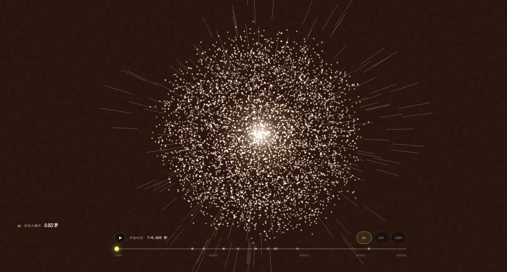
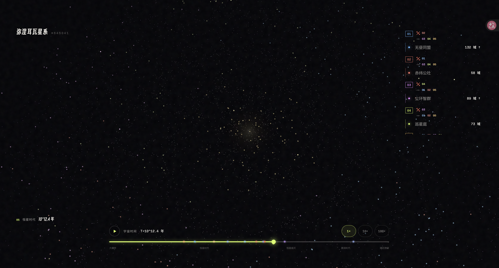
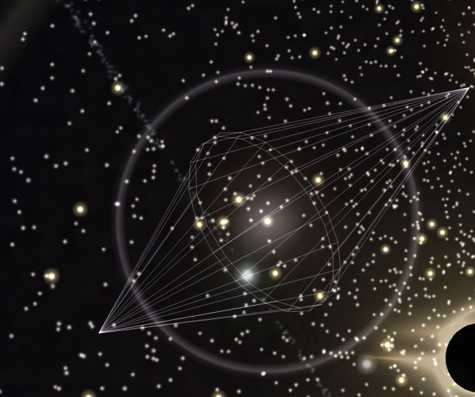
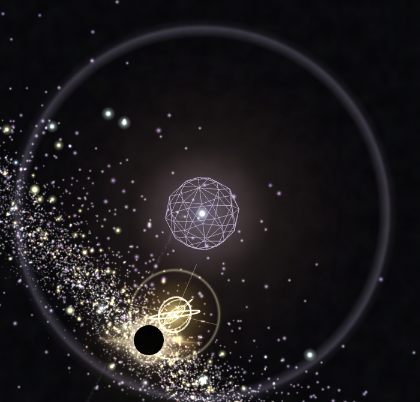
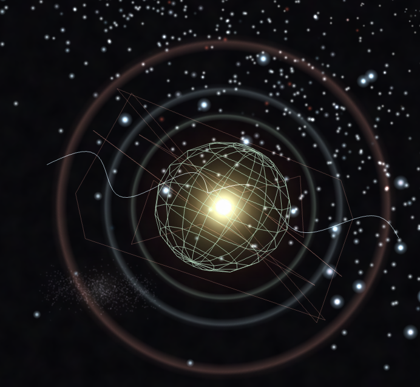
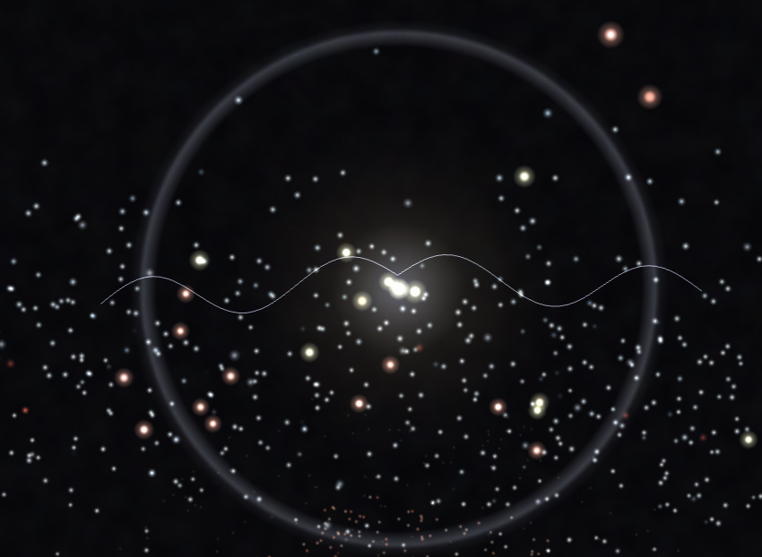
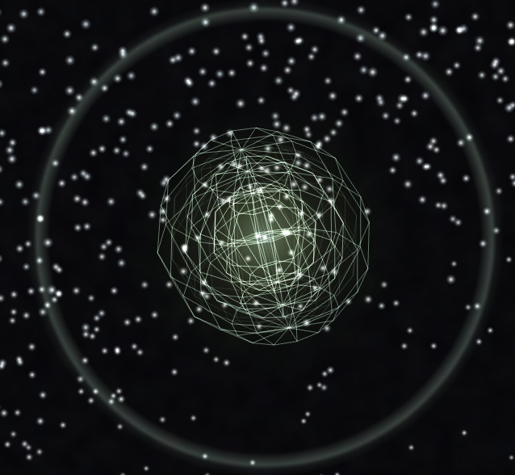
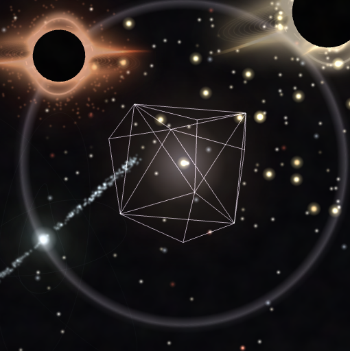
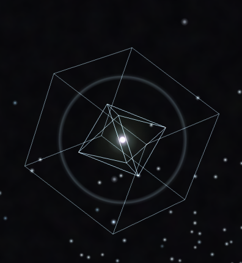

# 随机宇宙发生器

一个运行在浏览器中的交互式宇宙生成与演化模拟器。每个宇宙由一个 16 位种子确定；程序会据此生成一套相互关联的物理参数、一种星系形态、一段从炽热大爆炸到远未来结局的宇宙史，以及在其中诞生、扩张、结盟、冲突和消亡的文明。


> 这是一件以现代宇宙学时间线为骨架的科普与生成艺术作品。它使用可解释、可复现的约化模型连接“物理常数—宇宙结构—恒星—事件—文明”，但不是科研级 N 体、恒星结构、流体或生命演化求解器。

## 目录

- [项目能做什么](#项目能做什么)
- [一、仿真器：模拟对象与公式](#一仿真器模拟对象与公式)
- [二、一个种子包含多少种宇宙可能](#二一个种子包含多少种宇宙可能)
- [三、生成的五类星系形态](#三生成的五类星系形态)
- [四、宇宙事件系统](#四宇宙事件系统)
- [科学边界](#科学边界)
- [操作与本地运行](#操作与本地运行)
- [项目结构](#项目结构)

## 项目能做什么

- **种子化创世**：相同种子在相同版本中生成相同的参数、星系、事件和文明历史，可反复拖动时间轴验证同一状态。
- **关联式宇宙参数**：光速、引力、精细结构常数、质子/电子质量比、膨胀率、暗能量、原初涨落和微波背景温度会继续影响复合、结构形成、恒星规模、生命机会和远未来。
- **五类星系**：棒旋、絮状螺旋、环状、椭圆和不规则星系分别使用独立的空间采样规则生成。
- **完整宇宙时间轴**：用分段对数与指数坐标把 `T+0.001 秒`、`10^1200 年`乃至渐近无限远压缩到 `0–1000` 的可交互时间轴。
- **条件宇宙结局**：宇宙可能走向渐近热寂、大撕裂、大坍缩，或被更早发生的真空衰变覆盖。
- **15 组天体事件家族**：每类事件都有种子化参数模型、发生次数、空间范围、残骸和文明后果，而不只是固定动画。
- **环境与观测事件层**：星系环境、致密天体信号、行星气候—生物圈因果链和远未来事件会按宿主、前置事件与宇宙终局条件出现。
- **文明演化**：5–15 个初始文明样本在 720 个宜居节点上经历生物圈演化、殖民、接触、过滤器、迁徙、巨型工程、考古、冲突和衰亡，并可能产生分裂继承者、提升物种、相对论迟归者、跨星系殖民地或黑洞能源文明。
- **文明编年史与观测者模式**：点击任意文明可查看其完整因果事件链、生命演化与能源等级；切换到该文明的视角后，尚未进入其空间光锥的事件会被灰化并禁止交互，播报与观测数据则按实际信号延迟更新。
- **文明内部模型、经济与技术树**：人口、物质、能源、算力、生物承载力、物流、治理、科研和稳定度共同演化；技术按前置条件从行星工业推进到宇宙逃逸，并支付资源与稳定成本。
- **局部星系群**：每个种子生成 4–6 个确定性伴星系；成功的跨星系迁徙会在三维地图上建立真实目标、外域人口和可见航线。
- **整个可观测宇宙**：从当前星系连续拉远到由 12,000 个代表性星系、超星系团、纤维与空洞构成的确定性宇宙网；纤维完全由星系密度呈现而不绘制连接线，所有结构会随宇宙时间形成、熄灭并响应最终结局。
- **全宇宙文明活动**：在当前主星系文明之外，宇宙尺度会稳定生成其他星系的世代舰队、播种探针和时空中继航行；启航、在途、抵达、外域建立与失联均由时间轴驱动。
- **观测不确定性与因果图**：编年史同时展示模拟真值、文明实际收到的延迟信号和玩家外推区间；事件链可在缩放、拖动的节点图中浏览并跳转。
- **舰队级跨星系航行**：舰队保存目标、距离、速度、人口、补给、进度与抵达时间，可能抵达、途中分化、失联或返航；当前星系使用实体信标，全宇宙视图使用无连线航行光点。
- **性能与无障碍**：文明推演默认运行在 Web Worker，渲染使用稳定的 WebGL 路径；提供键盘选星和因果图文本描述。
- **多宇宙比较与历史复现**：可比较当前种子的确定性邻近变体，用链接保存种子与时间点，并将文明历史导出为带因果标识的 JSON。
- **自由探索**：可旋转、缩放星系，播放、倍速或拖动宇宙时间，并在恒星时代点击恒星查看样本信息。

## 项目截图

### 从炽热大爆炸开始



### 文明扩张与阵营关系



### 文明事件图鉴

下面的事件画面来自时间轴中的文明演化层。除“复杂生物圈形成”采用天体生物学约化模型外，其余事件均属于用于探索文明选择与长期后果的科幻假设；同一事件的最终结果会随种子、文明状态和技术前置条件改变。

#### 母宇宙逃逸工程



双向线框光锥代表文明试图越过母宇宙因果边界。只有完成黑洞采能等前置技术的文明，才可能尝试人造婴儿宇宙、真空工程、时空捷径或因果闭环计算；成功后，母宇宙只能记录该文明从可观测范围中消失，失败则会造成长期资源赤字、技术倒退与社会凝聚力下降。

#### 恒星巨构工程


多层环状结构表现分布式恒星采能群逐步包围母恒星。稳定运行时，文明获得恒星尺度能源，疆域恢复与防御能力随之增强；若轨道控制失稳，采能单元会发生碎片级联并波及多个恒星域。

#### 知识方舟封存



发光多面体是分散式档案网络的视觉化身，其中封存生物谱系、工程知识与历史记录。方舟不会直接阻止文明衰亡，但能在疆域完全丧失后、且恒星能源窗口仍然开放时，提供一次降级复兴的机会。

#### 行星地球化工程



绿色线框行星与扩散中的大气光晕表示持续多个世代的环境改造。工程成功会建立自维持生物圈，提高宜居前沿、基础设施和人口承载力；若生态循环进入不可逆失衡，边境殖民地会受损并被迫撤离。

#### 相对论殖民分化



分离的远征航迹象征高速舰队与母文明之间不断扩大的时间差。远征队归来时，舰上社会已经经历独立历史，并作为“迟归者”继承部分恒星域；它与母文明保留共同起源，却通常维持疏远而中立的关系。

#### 复杂生物圈形成



层层展开的球状网络对应“原始生命—生态扩张—复杂多细胞生命—技术物种”的演化链，部分种子还会插入雪球期、大灭绝、海洋酸化或恒星耀斑期等挫折。它是一条可回放的母世界生命史，用于连接宇宙条件与文明诞生，不代表对现实生命演化的精确预测。

#### 先驱遗迹唤醒



不规则几何体表示早于当前文明纪元的休眠结构。成功解码可带来跨代工程技术跃迁；若触发遗迹的防御协议，解码站与邻近航路将受损，文明的外部可见度也可能因此上升。

#### 数字意识迁移



外层立方体与内层晶格表现承载人口的分布式计算基质。稳定迁移能形成可复制、可迁移的数字心智，提高辐射韧性、扩张能力和晚期能源效率；若无法解决副本权利与身份一致性，社会会陷入持续的人格分叉与网络污染。

## 一、仿真器：模拟对象与公式

### 1.1 可复现的随机宇宙

种子格式为 `XXXX-XXXX-XXXX-XXXX`，每位可使用 `0–9` 或 `A–Z`。有效输入空间共有 `36^16 ≈ 7.96 × 10^24` 个种子；自动生成器还要求种子同时包含字母和数字。

种子先被哈希为四个 32 位状态，再由独立的命名空间派生随机序列。宇宙参数、星系、文明、事件和瞬变模型各自使用固定命名空间，因此新增一个模块时不会轻易打乱其他模块的随机结果。代码中不会用 `Math.random()` 绕过这条链路。

下文用 `U(a,b)` 表示区间均匀分布，用 `N(0,1)` 表示标准高斯分布；`clamp(x,a,b)` 表示把 `x` 限制在 `[a,b]`。

### 1.2 基础参数与派生量

界面中的带星号参数都是相对现实宇宙的无量纲倍率。

| 参数 | 生成范围 | 在模型中的作用 |
| --- | ---: | --- |
| 光速倍率 `c*` | `U(0.38, 1.84)` | 原子束缚标度、事件因果传播范围 |
| 引力倍率 `G*` | `U(0.52, 1.76)` | 结构形成、轨道角速度、致密并合抛射 |
| 精细结构常数倍率 `α*` | `U(0.72, 1.28)` | 化学稳定性、原子束缚与复合时间 |
| 质子/电子质量比倍率 `μ*` | `U(0.82, 1.18)` | 化学稳定性、原子束缚、致密残骸阈值 |
| 膨胀率倍率 `H*` | `U(0.65, 1.45)` | 当前年龄、复合与首星时间、结构形成 |
| 暗能量占比 `ΩDE` | `U(0.48, 0.82)` | 当前年龄、恒星形成终止、宇宙结局 |
| 原初涨落倍率 `Q*` | `U(0.55, 1.75)` | 密度结构坍缩与首星形成 |
| CMB 温度 `TCMB` | `U(1.9, 4.4) K` | 复合时间与宜居度 |

这些量不会停留在展示层，而会继续生成下面的派生量。

**化学稳定性**

```text
Cchem = exp(-((α* - 1) / 0.17)^2 - ((μ* - 1) / 0.14)^2)
```

当精细结构常数或质量比远离参考值时，可稳定元素和复杂化学的机会会快速下降。

**结构形成效率**

```text
Sstructure = clamp(G* × Q* / H*^0.72, 0.12, 2.8)
```

更强的引力和原初涨落促进结构形成，更快的膨胀抑制坍缩。

**稳定元素数与恒星规模**

```text
Nelement = max(2, round(118 × Cchem × U(0.82, 1.08)))
Nstar    = clamp(U(0.35, 3.2) × Sstructure, 0.08, 7.2) 万亿颗
```

屏幕只实时渲染 17,000 个恒星粒子；`Nstar` 是该宇宙的宏观估算，不是一粒等于一颗真实恒星。

**恒星形成结束与最后恒星熄灭**

```text
eform = clamp(12.5 - 1.35(ΩDE - 0.68) - 0.42(H* - 1), 11.8, 13.25)
elast = clamp(eform + U(0.68, 1.08), 12.8, 14.25)

tform-end = 10^eform 年
tlast-star = 10^elast 年
```

每个可视恒星粒子还会在 `4 × 10^10 年` 与 `tlast-star` 之间获得独立熄灭阈值，因此恒星不会同时消失。

**生命与文明宏观估算**

```text
Hhabitable = Cchem × clamp(1 - |TCMB - 2.725| / 3.5, 0.12, 1)
Plife      = U(0,1)^4 × 0.08 × Hhabitable
Nciv-est   = floor(Nstar × 10^5 × Plife × U(0.02, 0.7))
```

`Nciv-est` 是宏观估算。为保证每个种子都能展示外交和冲突，时间轴固定追踪 5–15 个初始文明样本；科幻事件还可能增加最多三个继承文明。界面显示的宏观估算仍只取估算值与初始样本数中的较大者；这不表示低生命概率宇宙在物理上必然存在文明。

### 1.3 宇宙年龄与早期里程碑

模型按每个种子选中的动态暗能量状态方程积分当前年龄。令 `Ωm = max(0.06, 1 - ΩDE)`，并从 `a = 10^-8` 积分到当前的 `a = 1`：

```text
F = ∫ d ln(a) / √[Ωm/a³ + ΩDE RDE(a)]
t0 = 13.8 Gyr × F / Freference / H*
```

其中 `RDE(a)` 由该宇宙的 `w0/wa` 反向积分，`Freference` 使用 `Ωm = 0.315`、`w = -1`。这让演化标量场、幽灵暗能量等分支的过去膨胀史也参与“今天”的计算，而不是只改变未来结局。

物质—辐射平衡、原子束缚、复合和第一代恒星使用以下约化关系：

```text
Batom = α*^2 × c*^2 / μ*

trec = clamp(
  380000 年 × (TCMB / 2.725 / Batom)^1.5 / H* × √(0.315 / Ωm),
  40000 年,
  4000000 年
)

teq = clamp(
  50000 年 × (TCMB / 2.725)^6 / H*^4 × (0.315 / Ωm)^2,
  5000 年,
  0.85 × trec
)

tfirst-star = clamp(
  1.8 × 10^8 年 / Sstructure^0.7 / Q*^0.35 / √H*,
  3 × 10^7 年,
  9 × 10^8 年
)

tmature-galaxy = clamp(5.4 × tfirst-star, 1.8 × tfirst-star, 3.2 × 10^9 年)
```

第一批恒星不会把完整星系一次性“淡入”。模型先在星系中选择约 7 个彼此分离的过密区，再按“局部点火时间 + 到最近点火区的传播延迟 + 随机坍缩延迟”为每颗恒星分配出生时间。气体从更弥散的位置向最终星系位置收缩，电离泡随后扩张并重叠。

### 1.4 星系轨道与黑洞引力

17,000 个恒星粒子不会相互做 `O(N²)` 两两求力，而是在一个可直接由时间轴求值的软化势中运动。半径为 `r` 的恒星使用：

```text
Ωorbit = min(
  0.095,
  0.055 × √[G* × (Mcenter / (r + 0.12)^3 + 0.72 / (r + 1.8)^2)]
)

Mcenter = 1.35（有中央黑洞）或 0.16（无中央黑洞）
```

第一项近似中央致密天体的开普勒势，第二项近似星系盘/晕，使外区趋近较平坦的旋转曲线。盘状星系共享主角动量方向；椭圆和不规则星系允许更大的轨道面倾角，但不会让一半恒星看起来反向旋转。

双黑洞附近另使用软化重心势。局部角频率满足 `Ω ∝ √(M / (r² + ε²)^(3/2))`，并加入合并前的双星力矩、合并后的质量损失、偏心扰动和捕获半径。进入捕获区的少量恒星逐渐落入并永久变暗，其他恒星只发生近掠偏转。

恒星级黑洞的霍金蒸发时间指数按质量缩放：

```text
eevap = clamp(67 + 3 log10(MBH / 10 M☉), 64, euniverse-max)
```

这对应蒸发寿命近似随 `M³` 增长，也避免所有黑洞在时间轴上同时消失。

### 1.5 动态暗能量与宇宙结局

每个宇宙从四种暗能量模型中选择一种：

| 模型 | 概率 | 参数范围 | 典型结局 |
| --- | ---: | --- | --- |
| 宇宙学常数 | 34% | `w0 = -1, wa = 0` | 渐近热寂 |
| 演化标量场 | 28% | `w0 ∈ [-0.96,-0.76]`，`wa ∈ [-0.1,0.1]` | 渐近热寂 |
| 幽灵暗能量 | 20% | `w0 ∈ [-1.22,-1.035]`，`wa ∈ [0.015,0.14]` | 有限时间大撕裂 |
| 反转势能 | 18% | `w0 ∈ [-0.98,-0.78]`，`wa ∈ [-0.08,0.08]` | 膨胀反转后大坍缩 |

状态方程采用有界的 Barboza–Alcaniz 型参数化：

```text
w(a) = w0 + wa(1 - a) / [a² + (1 - a)²]
```

积分器每步使用 `Δln(a) = 0.012`，在中点更新暗能量密度因子：

```text
RDE,next = RDE × exp[-3(1 + wmid) Δln(a)]
E²(a) = Ωm / a³ + ΩDE × RDE - Vnegative(a)
Δt = (14.5 Gyr / H*) × Δln(a) / √E²
```

只有反转势能分支含有：

```text
Vnegative(a) = 0.22 ΩDE (a / aturn)^2.35
```

当 `E² ≤ 0` 时膨胀停止，模拟器继续反向积分到 `a < 10^-8`，得到大坍缩时间。幽灵暗能量则用有限剩余寿命近似推演大撕裂。

此外，每个宇宙有 16% 概率处在亚稳真空。真空寿命从 `10^10.55` 至 `10^92` 年间按指数均匀抽样；若它早于原结局，就以真空衰变覆盖热寂、大撕裂或大坍缩。

渐近热寂宇宙还会以等权生成分支选择一种重子物质远未来：`10^34.5–10^49 年`的质子衰变路径，或质子长期稳定路径。该等权选择只是生成器权重，不代表实验或理论给出的物理概率。两条路径互斥：质子衰变后不会再生成黑矮星超新星；只有质子稳定路径才保留约 `10^1100 年`之后的黑矮星事件。

### 1.6 时间轴压缩

时间轴的 `0–1000` 是视觉坐标，不是线性年份。早期宇宙使用由该种子实际算出的里程碑，未来使用分段对数映射：

| 时间轴位置 | 物理时间或阶段 |
| ---: | --- |
| `0–18` | `0.001–1 秒` |
| `18–55` | `1–180 秒` |
| `55–115` | `180 秒–teq`（辐射主导） |
| `115–145` | `teq–trec`（物质主导、仍为等离子体） |
| `145–245` | `trec–tfirst-star` |
| `245–340` | 恒星时代的宇宙黎明子阶段：`tfirst-star–tmature-galaxy` |
| `340–470` | 成熟星系至该宇宙的当前年龄 `t0` |
| `470–650` | 当前年龄至 `10^14 年` |
| `650–845` | 最后恒星与简并时代，至约 `10^40 年` |
| `845–950` | 黑洞时代，至该宇宙最长寿黑洞蒸发 |
| `950–995` | 暗时代的超远未来视觉章节，从最后黑洞蒸发延伸至 `10^1200 年` |
| `995–1000` | 暗时代继续无界增长并趋近热寂；`1000` 表示 `T→∞` |

`950–995` 仍保留“超远未来”视觉章节以容纳极端时间事件，但它不再作为正式宇宙时代；从最后黑洞蒸发开始，时代名称统一为“暗时代 · 热寂趋近”。`10^308` 年以上的时间无法用 JavaScript 普通数值表示，因此内部保存 `log10(年)`，事件排序、标签和时间轴往返不需要构造溢出的年份。有限时间结局仍把“当前年龄—结局”整体重新映射到 `470–1000`，避免在大撕裂、大坍缩或真空衰变前跳过大段历史。`1×` 播放完整旅程约 35 分钟，早期宇宙和终局前会刻意放慢；`10×` 约 3 分 30 秒，`100×` 约 21 秒。

### 1.7 文明仿真

文明层从 17,000 个恒星样本中抽取最多 720 个宜居节点，每个节点连接空间中最近的 6 个邻居。5–15 个初始文明的母星通过“多次候选中最大化彼此距离”的方式选出，随后每个时间轴单位保存一次确定性快照。分裂、提升与相对论分化事件会在同一图上增加继承文明，并重新分配部分疆域。

每个文明具有四项行为参数：

| 参数 | 范围 | 作用 |
| --- | ---: | --- |
| 侵略性 | `U(0,1)` | 提高摩擦、敌对和进攻倾向 |
| 合作倾向 | `U(0,1)` | 提高接触后的关系分数 |
| 扩张率 | `U(0.72,1.36)` | 决定每步殖民前沿尝试数 |
| 韧性 | `U(0.68,1.32)` | 提高疆域恢复速度，降低灾变摧毁率 |

行为参数之外，每个时间单位还会更新九项对外展示的内部状态：人口受生物承载力与资源供给约束；物质随疆域产出、人口消耗和工程支出变化；能源由技术、巨构与黑洞设施提供；算力受技术和数字基质影响；生物承载力会随地球化与生态损伤变化；物流综合物质、能源、算力、治理和稳定度；治理受合作倾向、凝聚力和冲突影响；科研由技术底座、能源与先驱知识推动；稳定度综合资源、治理、能源、凝聚力、战争和信息污染。模拟还会由物质、承载力和物流推导综合资源值，这些状态共同影响扩张能力、技术增长与长期生存。

技术路线按前置关系推进：

```text
行星工业 → 戴森群 → 恒星推进器 → 黑洞采能 → 宇宙逃逸
```

每次解锁会消耗资源与能源，并可能降低短期稳定度。黑洞采能要求宇宙存在中央黑洞，宇宙逃逸必须先完成黑洞能源阶段；原有巨构、恒星工程、黑洞文明和逃逸事件会成为相应节点的工程触发条件。

两个文明的初始亲和度为：

```text
affinity = 0.28(coopA + coopB) - 0.24(aggrA + aggrB) + U(-0.16,0.16)
```

相邻接触后，分数越过 `0.30` 形成友好关系，低于 `-0.26` 进入冲突；关系也会因失去接触而衰减。友好网络增加疆域恢复和扩张能力，敌对文明则比较：

```text
attack = sourceStrength
       × (0.72 + 0.76 × aggression + U(0,0.35))
       × (0.72 + 0.18 × energy + 0.10 × research)

defense = targetStrength
        × (0.84 + 0.52 × resilience + U(0,0.28))
        × (0.70 + 0.12 × resources + 0.08 × governance + 0.10 × stability)
```

事件按真实空间距离和喷流方向命中节点。节点被摧毁的概率为：

```text
Rsubstrate = 1.3（已完成稳定数字迁移）或 1.0（其他文明）
Pdestroy  = clamp(0.62 × severity / max(0.65, resilience × Rsubstrate), 0, 0.9)
```

宿主恒星彻底解体、被潮汐撕碎或落入黑洞时，节点永久失效；普通辐射灾害则降低节点强度，并可在事件定义的恢复窗口中部分恢复。恒星能源枯竭或有限时间宇宙结局开始后，普通物质文明逐步衰亡。知识方舟可以在能源窗口仍开放时完成一次降级复兴。每个初始文明另有 1% 概率在诞生后 130–205 个时间轴单位发生“高维转化”，这是明确的科幻设定。

## 二、一个种子包含多少种宇宙可能

“随机宇宙”不是给一组独立数字换皮，而是一棵由同一个种子驱动的因果树：

```text
16 位种子
├─ 基础常数与宇宙组成
│  ├─ 化学稳定性、元素数、生命机会
│  ├─ 复合、首星、成熟星系与当前年龄
│  └─ 结构效率、恒星规模与恒星寿命
├─ 暗能量与真空状态
│  └─ 热寂 / 大撕裂 / 大坍缩 / 真空衰变
├─ 星系形态与中央黑洞
│  └─ 恒星轨道、活动星系核与可发生事件
├─ 天体事件日程
│  └─ 残骸、引力场、辐射束、文明损伤与恢复
└─ 文明性格与母星
   └─ 扩张、关系、阵营、冲突、灾变和衰亡
```

主要分支包括：

- **五类星系形态**，每类使用不同的空间分布，而不是仅更换名称。
- **四类暗能量模型与四种最终结局**。真空衰变可能抢在其他结局之前发生，因此暗能量模型与最终结局不是一一对应。
- **中央巨型黑洞**的形成概率随形态变化：棒旋 96%、絮状螺旋 92%、环状 72%、椭圆 99%、不规则 34%。
- **活动星系核**只可能出现在有中央黑洞的宇宙中，条件概率依次为 10%、7%、5%、4.5%、2.5%。
- **恒星与事件丰度**受结构形成效率影响。富恒星、结构形成旺盛的宇宙更可能在“每类至少一次”的基础上抽到重复事件。
- **事件条件会裁剪历史**：没有中央黑洞就没有潮汐瓦解；过早的大撕裂、大坍缩或真空衰变会截断尚未来得及发生的恒星事件和黑洞时代事件。
- **同种子可回放**：事件发生位置、文明受灾节点、黑洞反冲方向和每颗恒星的轨道都可由种子与时间点重新计算，不依赖播放顺序。

因此，“可能性”不只是 `36^16` 个编号，还来自连续参数的组合、条件分支和空间演化。两个外观相似的螺旋星系也可能拥有完全不同的年龄、恒星寿命、暗能量历史、事件序列和文明结局。

## 三、生成的五类星系形态

所有形态都使用 17,000 个恒星粒子，但坐标采样完全不同。核心颜色向边缘色相渐变，亮度、恒星出生和死亡时间也逐粒生成。

| 形态 | 空间生成规则 | 视觉特征 |
| --- | --- | --- |
| **棒旋星系** | 20% 粒子进入细长中央棒，9% 进入厚核球，其余粒子分配到两条主旋臂；旋臂角满足 `θ = arm·π + 0.46(r-3) + noise` | 明亮棒核、两条主导长臂、薄盘随半径略增厚 |
| **絮状螺旋星系** | 使用 `7–11` 条短臂采样，`r = U^0.68 × 14`，角度随半径缠绕，并以正弦项制造断续密度斑块 | 多臂、破碎、羽毛状，外盘更厚更松散 |
| **环状星系** | 72% 粒子集中在 `r ≈ 8.4` 的高斯主环，18% 构成中心核，其余形成 `r = 4–12` 的碎环；X 轴再拉伸 1.15 倍 | 主环清晰，带椭圆投影、核区和低密度环间区 |
| **椭圆星系** | 三轴高斯分布，轴尺度约为 `5.5 : 2.35 : 3.75`，再用 `U^0.38` 控制径向衰减并截断在 `r = 13.5` | 无旋臂、中心集中、厚实的三轴椭球 |
| **不规则星系** | 87% 粒子落入 4–6 个随机星团，13% 形成一条弯曲潮汐尾；星团在三个方向使用不同离散度 | 偏心、成团、无统一对称轴，带潮汐拉伸结构 |

星系形态还影响中央黑洞与活动核概率，但不会直接决定宇宙结局。恒星形成期间，粒子从弥散气体云向这些目标坐标坍缩；形成后再进入差速轨道，因此形态不是静态贴图。

## 四、宇宙事件系统

### 4.1 事件如何被安排

只要宇宙条件允许，每类基础天体事件至少出现一次。在此之上，事件使用有上限的泊松抽样决定重复次数：

```text
Aactivity = clamp(0.38 + 0.16 × Nstar + 0.18 × Sstructure, 0.55, 2.35)
Nevent = 1 + min(Poisson(repeatRate × Aactivity), maximumOccurrences - 1)
```

重复事件会在基础时间之后按带少量扰动的间隔排列，但不得越过最后恒星熄灭、有限宇宙终局或事件自身的最晚发生时间。事件影响半径还会乘上模型强度和光速因果缩放：

```text
Rlocal = Rstar-profile × rangeScale × (0.82 + 0.18√c*)
Rcivilization = Rciv-profile × rangeScale × √c*
```

其中 `rangeScale` 来自该次瞬变事件实际生成的能量、质量或吸积参数。喷流类事件还必须同时满足距离与方向锥条件，锥角由事件自身的喷流张角覆盖默认值。

科幻文明事件使用独立的种子化伯努利概率，允许某个宇宙完全不出现某一事件。其触发时间相对目标文明诞生时间生成，并受恒星能源窗口和有限时间宇宙终局约束。

### 4.2 当前实现的 15 组事件家族

| 事件 | 约化模型与关键公式/参数 | 结果与条件 |
| --- | --- | --- |
| **成对不稳定超新星** | 前身星 `140–255 M☉`、氦核 `64–133 M☉`；爆炸能随氦核质量非线性增至约 `76 Bethe` | 恒星完全解体，不留致密残骸；主要出现在早期恒星族群 |
| **年轻脉冲星诞生** | 中子星 `1.18–2.12 M☉`；`Lsd = 3.9×10^31(B/10^12 G)^2(1000 ms/P)^4 erg/s` | 形成持续存在的脉冲星和双极束流，并带局部引力场 |
| **经典新星** | 白矮星 `0.72–1.34 M☉`；`Mign = 2.2×10^-5(1.05/MWD)^3.2 M☉`，`trecur = Mign / Ṁ` | 表面热核爆发 2–4 次，白矮星保留并继续吸积 |
| **Ia 型超新星** | 在伴星吸积与双白矮星并合通道间选择；生成白矮星质量、镍-56 质量和 `0.85–1.55 Bethe` 能量 | 白矮星完全解体，不留残骸 |
| **红矮星超级耀斑** | 总能量 `10^34.4–10^36.25 erg`，2–5 次脉冲；生成 CME 速度、紫外占比和大气损失 | 宿主恒星不被摧毁，近轨行星受损后可部分恢复 |
| **长伽马射线暴** | 坍缩星 `22–72 M☉`；`Eiso = 10^51.4–10^54.1 erg`；`Ejet = Eiso(1-cos θ)` | 形成黑洞与窄角相对论喷流；只伤害落在双向锥内的目标 |
| **中子星并合千新星** | 双星 `1.12–1.92 M☉`；啁啾质量 `Mc=(M1M2)^(3/5)/(M1+M2)^(1/5)` | 留下大质量中子星或黑洞，产生短伽马喷流、富重元素抛射和波前 |
| **类星体短暂苏醒** | 中央黑洞 `10^6.5–10^9.2 M☉`；`Ṁ = 2.2(MBH/10^8)λEdd(0.1/η) M☉/yr` | 只在有中央黑洞的宇宙中出现；喷流可跨越大范围星域 |
| **磁星巨型耀斑** | 磁场 `10^14.2–10^15.35 G`，能量 `10^44.2–10^46.4 erg`，含硬脉冲和衰减尾波 | 无中央黑洞时作为核区事件；造成辐射损伤而非恒星摧毁 |
| **潮汐瓦解事件** | `rt = Rstar(MBH/Mstar)^(1/3)`；`tfb ∝ MBH^1/2 Mstar^-1/2 Rstar^3/2 β^-3` | 仅在有中央黑洞时发生；束缚碎片按 `t^-5/3` 回落 |
| **核坍缩超新星** | 前身星 `8.2–31 M☉`；质量账目为 `Mprog = Mej + Mrem + Mν` | 抛出外层并留下中子星或黑洞；残骸带持续局部引力 |
| **脉冲星自转突变** | 自转频率相对跃变量 `10^-9.2–10^-5.1`，并生成恢复比例与恢复期 | 改变脉冲节律，不造成大范围物理破坏 |
| **超亮超新星** | 前身星 `22–78 M☉`；在毫秒磁星引擎与星周物质相互作用间选择，能量 `3–18 Bethe` | 留下磁星或黑洞；峰值光度和残骸由模型结果驱动 |
| **失败超新星** | 前身星 `18–42 M☉`；`Mrem = Mprog(1-feject) - Mν`，大部分包层回落 | 只短暂增亮并产生暗弱尘埃外流，最后留下大质量黑洞 |
| **黑洞双星合并家族** | 双黑洞质量、自旋、有效自旋和啁啾质量；`Mrem=(M1+M2)(1-frad)`；反冲由质量不对称与自旋项合成 | 含恒星级双黑洞合并和晚期孤立黑洞捕获两个类型；展示旋近—合并—振铃，只有富气体环境出现余辉 |

源码中最后一组包含“双黑洞合并”和“孤立黑洞捕获合并”两个事件类型，它们共用黑洞双星物理模型，但使用不同质量范围、发生年代和环境。因此界面可出现 16 个类型标识，对应上表 15 组事件家族。

### 4.3 科幻文明事件

时间轴以菱形标记显示科幻事件，并在播报中明确标注“科幻假设”。它们提取经典科幻中的通用问题，但不复用作品角色、专有组织或具体情节。星系近掠使用虚线圆形标记并标注“天体演化模型”，避免与虚构设定混淆。

| 事件 | 分支 | 模拟结果 |
| --- | --- | --- |
| **异常窄带信号** | 回应、静默或威慑 | 改变文明可见度、技术值与双方关系 |
| **自复制探针扩散** | 受控航路或自治失控 | 提高扩张尝试；失控时周期性吞噬边缘疆域 |
| **恒星巨构工程** | 稳定采能或轨道级联 | 稳定巨构提高恢复和防御并遮暗宿主恒星；失稳则削弱多个疆域 |
| **星际共同体分裂** | 远端殖民地独立 | 生成继承文明、转移部分疆域并建立敌对关系 |
| **知识方舟封存** | 存档与降级复兴 | 文明完全失去疆域后可在可用能源窗口内恢复一次 |
| **提升物种实验** | 新物种形成独立文化 | 生成与创造者初始友好的新文明，并划出起始疆域 |
| **卫星解体与轨道撤离** | 成功撤离或聚居域失联 | 改变疆域强度与凝聚力；成功后保留轨道避难状态 |
| **行星地球化工程** | 稳定生物圈或生态崩溃 | 成功时提高前沿扩张和基础设施，失败时削弱边境疆域 |
| **数字意识迁移** | 稳定分布式心智或人格分叉 | 稳定迁移提高辐射韧性、扩张与晚期能源效率 |
| **先驱遗迹唤醒** | 技术解码或防御协议苏醒 | 获得技术跃迁，或让解码站和邻近航路受损 |
| **信息瘟疫爆发** | 验证隔离或认知感染 | 降低凝聚力与疆域强度，并可能沿友好通信关系传播 |
| **相对论殖民分化** | 迟归远征队形成独立历史 | 生成保持疏远中立的继承文明并转移部分疆域 |
| **伴星系近掠** | 星暴或活动星系核反馈 | 对所有当时存续文明施加短期供能增益或疆域削弱 |
| **复杂生物圈形成** | 原始生命、生态扩张、挫折与复杂生命 | 为文明保存一条可回放的母世界生命演化路径 |
| **文明过滤器危机** | 跨越、制度重构或系统性崩溃 | 改变凝聚力、技术、恢复能力和疆域规模 |
| **世代舰队远征** | 远端殖民、流浪舰队或失联 | 建立不连续疆域，或留下无法确认结局的导航信标 |
| **恒星工程时代** | 恒星抬升、套娃脑或恒星推进器 | 提高基础设施并延长能源窗口；失稳时损伤多个恒星域 |
| **文明形态分化** | 生物、机器、群体、数字或低可见度形态 | 让不同形态采用不同能源、通信、凝聚与灾害响应规则 |
| **宇宙考古发现** | 继承、误读或唤醒遗产 | 灭亡文明的档案、探针与污染区会继续影响后来者 |
| **光锥幽灵信号** | 延迟广播与未知当前状态 | 明确区分“看见对方过去”和“确认对方仍存续” |
| **信号暴露后续** | 验证、威慑或全域静默 | 由早期接触事件派生长期制度后果，形成因果事件链 |
| **费米情景** | 大过滤器、静默博弈、稀有生物圈、观察者隔离或短暂窗口 | 每个种子选择一个主导解释，影响文明叙事与可见度 |
| **星系近掠后续** | 潮汐尾、流浪恒星、形成熄灭或流浪黑洞 | 把单次近掠扩展为可持续数个阶段的星系演化链 |
| **跨星系迁徙** | 抵达、途中分化、失联或返航 | 消耗母文明的人口、物质与能源；成功后在真实伴星系建立外域人口和可见航线 |
| **黑洞能源文明** | 吸积盘采能、旋转能提取或霍金辐射收集 | 建立第三阶能源基础设施；失稳时造成大范围疆域损伤 |
| **母宇宙逃逸工程** | 人造婴儿宇宙、真空工程、时空捷径或因果闭环计算 | 成功时进入母宇宙外存续状态；失败时降低技术与凝聚力，并留下长期资源赤字 |

文明快照记录人口、物质、能源、算力、生物承载力、行星气候、生物信号、物流吞吐、治理、科研、稳定度、技术树、可见度、凝聚力、机器自治、方舟、巨构、提升、地球化、数字载体、先驱知识、信息感染、相对论分支、过滤器、迁徙、恒星工程、跨星系定居、外域人口、黑洞能源、母宇宙逃逸、文明形态、能源等级、遗产、信号延迟和因果响应状态。进入探索器后，这些分支会在渐进加载期间按种子确定性预计算，文明推演优先交给 Web Worker；因此后台加载完成后来回拖动时间轴，仍会得到相同历史。

事件可通过 `sourceEventId` 和 `causalRootId` 串联。例如“首次信号 → 光锥幽灵信号 → 验证/威慑/静默制度”，以及“伴星系近掠 → 潮汐尾/形成熄灭/流浪黑洞”都共享同一因果根。时间轴正向播放或反复拖动时，整条链都会得到相同结果。

文明编年史会把主体事件、接触事件和继承关系汇总到可跳转时间线与可缩放因果图。能源阶梯从行星能源、恒星能源、黑洞能源推进到熵管理；“观察者模式”根据文明母星与事件目标的实际三维距离、当前光速倍率和事件发生时刻计算信息抵达时间。档案同时列出模拟真值、文明收到的历史信号和带误差区间的玩家推测，避免让全星系即时共享确定信息。

局部星系群由当前种子独立生成 4–6 个伴星系。跨星系舰队具有速度、人口、补给、距离、预计抵达时间与确定性结局；伴星系和航线仍保留完整模拟。选择“查看整个宇宙”后，当前星系与局部群会缩小为宇宙网中的一个已标记节点，外围展示 12,000 个代表性星系以及由点云密度自然形成的超星系团、纤维和空洞，不绘制宇宙网连接线。全宇宙文明层会额外推演其他星系之间的启航、在途、抵达、外域建立和失联事件，并以移动光点与短促脉冲呈现。文明在母星系内的物质、能源与计算运输仍以低亮度物流线显示。

创世界面的“比较邻近宇宙”会从当前种子派生三个确定性变体，方便检查微小种子变化如何改变常数、星系与终局。URL 使用 `seed` 和 `t` 参数保存宇宙及观察时刻；本地书签保留最近 20 个观察点；导出的 `random-universe-history-v1` JSON 包含文明状态、事件角色与因果链标识。

灵感来源包括《基地》的文明衰落与知识保存、《黑暗森林》的暴露与静默、《时间之子》的提升物种、《环形世界》的恒星尺度巨构、《七夏娃》的避难与文明重建、《火星三部曲》的行星改造、《雪崩》的信息危害、《太空漫游》的先驱遗迹，以及《永恒战争》的相对论文化分化。

### 4.4 环境、观测与远未来事件

这一层不强制让每个种子出现全部事件。事件必须找到兼容宿主、满足因果前置条件，并且不能越过有限时间宇宙结局。

| 层级 | 已接入事件 | 仿真作用 |
| --- | --- | --- |
| 星系环境 | 星系碰撞/潮汐瓦解、星暴期、活动星系核喷流转向、星系团冲压剥离、星系风爆发 | 碰撞派生星暴因果链；星暴提高短期能源与原料，冲压剥离及星系风改变长期气体供给 |
| 恒星演化 | 原恒星喷流、红巨星氦闪、公共包层、亮红新星、行星状星云、恒星无爆发消失 | 从质量、诞生/死亡时间和残骸类型中选择兼容宿主；公共包层合并可派生亮红新星 |
| 致密天体观测 | 快速射电暴、X 射线双星爆发、黑洞吸积态转换、脉冲星停止/恢复、引力微透镜、黑洞光子环耀斑 | 只从已经形成的兼容残骸中选择源；信号变化不会被误写成天体毁灭 |
| 行星与生命 | 生物大氧化、大型小行星撞击、失控温室、全球冰封/解冻、生物信号消失 | 使用“撞击 → 气候跃迁 → 生物信号变化”因果链，持续修改母世界承载力、稳定度和外部可见度 |
| 文明观测 | 异常凌日、红外废热、窄带漂移、激光信标、文明信号静默、巨型工程遮蔽、相对论舰队尾迹 | 依赖真实行星系统、稳定恒星工程、已知信号或跨星系舰队前置事件，并保留天然解释的观测简并 |
| 远未来 | 最后一颗普通恒星熄灭、白矮星碰撞、质子衰变时代、星系引力蒸发、流浪黑洞掠过、霍金末期爆发、黑矮星超新星、最后可探测信号 | 仅在渐近热寂分支生成，并按宿主和时间窗口裁剪；质子衰变与黑矮星超新星属于互斥路径，后者明确标记为高度推测 |

### 4.5 事件如何改变星系与文明

每个事件先从真实恒星坐标中选择爆发源，再根据事件类型建立影响轮廓：

- 球对称事件按距离选取最近恒星；伽马射线暴、千新星、年轻脉冲星和类星体还要求目标落在喷流锥内。
- 爆发源可能完全消失、短暂变暗或成为中子星/黑洞；持续残骸会建立局部软化引力场。
- 双黑洞并合会辐射总质量的约 2.8%–9%，残余质量和反冲速度直接来自本次模拟参数。
- 引力波对恒星采样点的横向形变经过视觉放大，只用于帮助观察，不代表真实星系尺度位移。
- 每个文明节点绑定一颗确定宿主恒星，因此宿主被毁或捕获时，该节点永久失效；辐射和冲击事件则根据强度、方向与文明韧性决定“削弱”或“失去”。
- 事件播报中的残骸质量、爆炸能量、受影响疆域和恢复结果均来自该种子的实际计算，不是预写结局。

## 科学边界

本项目明确区分“物理启发的约化关系”和“科研级数值模拟”：

- 大爆炸表现为整个可观测区域的高温高密度与空间膨胀，不是从空间中某个中心向外爆炸。
- 自然常数变化只传播到可解释的标度关系；项目没有重新求解完整核物理、恒星结构或量子场论。
- 星系运动是时间轴可逆的软化势，不是恒星间两两求力的完整 N 体积分。
- 动态暗能量、反转势能和真空衰变是条件模型，不是对现实宇宙结局的观测预言。
- 简并时代、质子衰变、霍金蒸发和暗时代依赖远未来假说，界面中标记为“假说”或“渐近”。
- 事件模型不包含完整的广义相对论磁流体、辐射输运和恒星内部结构；粒子、喷流、波前和碎片流尺度均为可视化压缩。
- 文明数量、外交、战争、灾后恢复、二十二类科幻文明事件与高维转化属于启发式或科幻层，不能用于推断现实生命概率；复杂生物圈、费米情景和星系近掠链是压缩后的天体生物学或天体演化模型。

天体事件与宇宙学模型的实现参考：

- [LIGO：GW150914 与旋近—合并—振铃](https://ligo.org/science-summaries/gw150914/)
- [Varma 等：合并残余黑洞的引力波反冲](https://arxiv.org/abs/2201.01302)
- [Lousto 与 Zlochower：黑洞残余质量、自旋与反冲拟合](https://arxiv.org/abs/1503.07536)
- [NASA Webb：中子星并合千新星与重元素形成](https://science.nasa.gov/missions/webb/nasas-webb-makes-first-detection-of-heavy-element-from-star-merger/)
- [NASA Chandra：黑洞潮汐瓦解恒星](https://www.nasa.gov/missions/chandra/a-giant-black-hole-destroys-a-massive-star/)
- [NASA Hubble：超新星与新星](https://science.nasa.gov/mission/hubble/science/science-behind-the-discoveries/hubble-stellar-explosions/)
- [NASA Hubble：脉冲星磁极束流](https://science.nasa.gov/mission/hubble/science/science-behind-the-discoveries/hubble-pulsars/)
- [NASA NICER：脉冲星自转突变](https://heasarc.gsfc.nasa.gov/docs/nicer/science_nuggets/20240502.html)
- [NASA Astrobiology：超级耀斑与行星宜居性](https://astrobiology.nasa.gov/news/superflares-and-the-habitability-of-planets/)
- [Barboza 与 Alcaniz：有界暗能量状态方程参数化](https://arxiv.org/abs/0805.1713)

## 操作与本地运行

### 操作指南

| 操作 | 效果 |
| --- | --- |
| 点击“生成新宇宙”或按 `R` | 重新生成宇宙 |
| 点击“进入宇宙” | 默认进入全屏，加载当前种子的星系与时间轴；浏览器拒绝全屏时仍可正常探索 |
| 拖动 / 滚轮 | 旋转视角 / 缩放星系 |
| 播放按钮 | 播放或暂停宇宙时间 |
| 展开倍率控件并拖动滑杆 | 在 `0.01×–100×` 之间连续调整时间流速；`0.1×`、`1×`、`10×` 为快捷吸附点 |
| 拖动时间轴 | 跳转并回看任意纪元；开启事件吸附后会自动对齐附近事件 |
| 在时间轴上滚轮 / 双击 | 围绕指针位置缩放时间轴 / 恢复完整时间范围 |
| 使用事件筛选按钮 | 在全部事件、天体事件、文明事件和科幻假设之间切换 |
| 点击彩色事件标记 | 单个事件会直接跳转；聚合标记会先展开局部事件详情 |
| 点击飞船按钮 | 显示并凸显星系内物流船与跨星系舰队 |
| 点击“种群” | 展开文明、阵营和外交关系 |
| 点击文明条目 | 打开文明编年史并跳转其因果事件 |
| 点击“以此文明观察” | 进入有限光锥视角；光锥外事件会被标为不可观测，档案改为显示延迟观测与推测区间 |
| 点击星系名称，再选择“查看整个宇宙” | 连续拉远当前星系，观察整个可观测宇宙的星系团、纤维和空洞 |
| 在星系菜单中选择“全屏模式” | 进入或退出浏览器全屏显示 |
| 在星系菜单中选择“沉浸式模式” | 仅展示星系；停止操作后自动隐藏界面，移动指针或点击画面可暂时唤回 |
| 切换“时间线 / 因果图” | 浏览线性历史，或缩放、拖动并点击因果节点跳转 |
| 点击“比较邻近宇宙” | 对照当前种子与三个确定性变体 |
| 保存时刻 / 复制链接 / 导出历史 | 在本机收藏观察点、分享当前种子与时间、导出文明 JSON |
| 点击恒星 | 在可观测阶段查看恒星样本信息 |
| 星图获得焦点后按 `←` / `→`、`Home` / `End` | 切换相邻恒星，或跳到首个 / 最后一个可见恒星 |
| 星图获得焦点后按 `Enter` 或空格 | 打开当前键盘选中恒星的详情 |
| 按 `Esc` | 依次收起当前打开的菜单、沉浸模式、事件筛选或详情、文明编年史和文明面板，最后返回创世界面 |

界面支持移动端布局，并尊重系统的“减少动态效果”设置。

### 本地运行

需要 Node.js 和 npm：

```bash
npm install
npm run dev
```

构建、测试与预览生产版本：

```bash
npm test
npm run build
npm run preview
```

页面使用按当前源码字符生成的得意黑子集。修改界面文案后，如本机已安装
[FontTools](https://fonttools.readthedocs.io/)，可重新生成字体文件：

```bash
npm run font:subset
```

### 技术栈

- [Vite](https://vite.dev/)：开发服务器与生产构建
- [Three.js](https://threejs.org/)：WebGL 场景、粒子、材质、相机和轨道控制
- Web Worker：后台文明推演
- 原生 JavaScript、HTML 与 CSS：领域模型、模拟逻辑和界面
- Node.js Test Runner：确定性、时间映射、质量守恒、引力和事件调度测试

## 项目结构

```text
random-universe/
├── index.html                     # 页面结构与交互控件
├── src/
│   ├── main.js                    # 应用入口、星系构造、事件与交互编排
│   ├── explorer-dependencies.js   # 点击进入宇宙后按需加载的探索器依赖
│   ├── domain/
│   │   ├── random.js             # 种子规范化、哈希与伪随机数
│   │   ├── universe.js           # 宇宙参数、派生量与早期里程碑
│   │   ├── cosmic-fate.js        # 暗能量积分与条件宇宙结局
│   │   ├── cosmic-time.js        # 物理时间和可视时间轴映射
│   │   ├── cosmic-web.js         # 可观测宇宙的星系团、纤维与星系采样
│   │   ├── stellar-dawn.js       # 第一代恒星的空间点火与形成
│   │   ├── local-group.js        # 确定性局部星系群与伴星系位置
│   │   └── orbital-motion.js     # 可逆轨道相位
│   ├── simulation/
│   │   ├── cosmic-civilizations.js # 全宇宙文明与星系际航行统计仿真
│   │   ├── civilization.js       # 文明扩张、关系、冲突与灾变快照
│   │   ├── civilization-events.js # 科幻文明事件目录、条件与继承文明
│   │   ├── civilization-worker-client.js # Web Worker 调度与主线程降级
│   │   ├── civilization-worker.js # 后台文明推演入口
│   │   ├── technology-tree.js    # 技术前置、解锁条件与工程成本
│   │   ├── observation.js        # 有限光锥观测、推测和误差范围
│   │   ├── intergalactic-travel.js # 跨星系舰队状态与航行时间
│   │   ├── ship-navigation.js    # 舰船路径、避障和航线分配
│   │   ├── transient-events.js   # 15 组瞬变事件物理参数模型
│   │   ├── event-occurrence.js   # 泊松重复事件调度
│   │   ├── black-hole-gravity.js # 星系势与双黑洞近场响应
│   │   └── compact-objects.js    # 致密残骸与蒸发时间
│   ├── rendering/                 # Three.js 天体、文明事件、纹理和时间轴视觉效果
│   ├── ui/                        # 宇宙数据、时间轴、文明编年史与可缩放因果图
│   ├── assets/                    # 构建时打包资源
│   └── style.css                  # 响应式视觉与动效
├── test/simulation.test.js        # 核心模型自动化测试
├── scripts/subset-font.mjs        # 从页面源码重新生成得意黑字符子集
├── public/fonts/                  # 字体与许可证
├── readme-photo/                  # README 截图
└── dist/                          # 生产构建输出
```

项目内置得意黑（Smiley Sans）字体，许可证位于 [`public/fonts/SmileySans-OFL.txt`](public/fonts/SmileySans-OFL.txt)。README 截图来自本项目实际运行界面。
